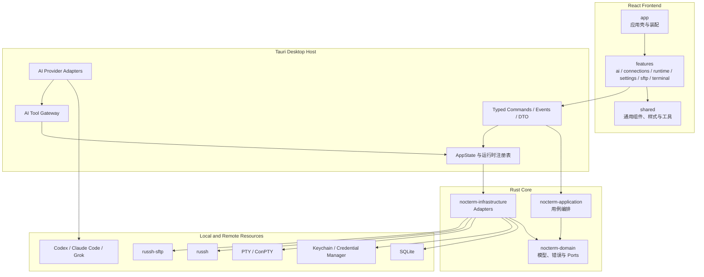
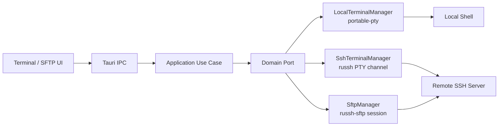
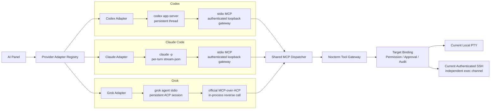
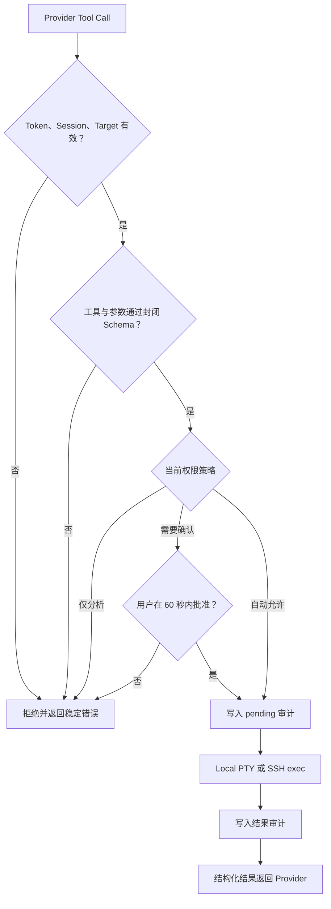

# Nocterm 技术架构

- 状态：当前实现基线
- 目标平台：macOS 14+、Windows
- 产品形态：本地优先的桌面终端客户端
- 验收流程：[测试与验收](testing.md)

本文是 Nocterm 唯一的技术架构说明。总体分层、SSH / SFTP、凭据、AI Provider、权限和关键技术决策均以本文为准；具体版本以源码、锁文件和发布产物为准。

## 1. 产品边界

Nocterm 在一个桌面应用中提供：

- 本地终端和多标签会话；
- SSH 连接、认证、主机密钥和远程终端；
- SFTP 文件浏览、操作、上传、下载和取消；
- 连接、分组、设置、AI 会话和脱敏审计的本地持久化；
- 绑定当前本地或 SSH 终端的 AI 辅助操作。

当前不建设账户体系、云端配置同步、Linux 正式发行版、插件市场、自研通用 Agent、远程服务器端 Agent 或独立服务器监控页。AI 面板中的结构化诊断工具不等同于监控产品。

## 2. 架构原则

1. **模块化单体**：一个桌面应用内保持清晰边界，不拆分没有部署价值的服务。
2. **单向依赖**：React 为 `app -> features -> shared`；Rust 为 `desktop -> application -> domain`，Infrastructure 实现 Domain Port。
3. **本地优先**：核心能力不依赖 Nocterm 云服务，业务数据保存在本机。
4. **凭据隔离**：SQLite 不保存密码或私钥内容，Provider 不能取得 SSH 凭据。
5. **目标绑定**：终端、SFTP 和 AI 操作必须绑定明确会话，不因失败静默切换执行环境。
6. **显式生命周期**：长任务具有唯一 ID、状态、超时、取消和唯一清理责任。
7. **跨平台前置**：平台差异集中在 Adapter 和装配边界，macOS 与 Windows 分别验收。
8. **契约优先**：UI 依赖稳定错误码，协议、目标和权限在后端重新校验。

## 3. 总体架构



### 3.1 前端边界

`apps/desktop/src` 按 Feature 组织：

```text
app/                    应用壳、路由和跨 Feature 装配
features/ai/            AI 面板、会话、审批和 Provider 展示
features/connections/   连接、分组、导入与备份
features/runtime/       桌面运行状态
features/settings/      外观、终端与关于设置
features/sftp/          双栏文件管理与传输
features/terminal/      本地及 SSH 终端
shared/                 无业务归属的组件、样式和工具
```

- Feature 只通过自身 `index.ts` 暴露能力；
- `shared` 不依赖 Feature；
- 业务 UI 不直接调用 `@tauri-apps/api`，IPC 收口到 Feature `api/`；
- Zustand 只管理 UI 状态，不访问数据库、凭据或子进程；
- 高频输出使用 event，状态变更使用 command，订阅必须可释放。

### 3.2 Rust 边界

```text
apps/desktop/src-tauri       IPC、DTO、事件、AI Provider 与依赖装配
crates/nocterm-application  用例编排与跨 Port 业务规则
crates/nocterm-domain       领域模型、稳定错误和 Ports
crates/nocterm-infrastructure
                            SQLite、PTY、SSH、SFTP 与凭据 Adapters
```

Domain 不依赖 Tauri、SQLite、文件系统或操作系统 API。Infrastructure 依赖 Domain 并实现 Port。Tauri Command 只做输入校验、权限检查、用例调用和 DTO 转换，不承载 SQL、SSH 或业务状态机。

## 4. 技术栈

| 层级       | 当前实现                                                         | 责任                                       |
| ---------- | ---------------------------------------------------------------- | ------------------------------------------ |
| 桌面容器   | Tauri 2                                                          | 窗口、IPC、事件、权限和装配                |
| UI         | React 19、TypeScript、Vite、Zustand                              | Feature UI、交互状态和样式                 |
| 终端渲染   | xterm.js                                                         | 本地与 SSH 终端显示、输入和尺寸同步        |
| Rust Core  | Rust 2024 workspace                                              | Domain、Application、Infrastructure        |
| 本地数据   | SQLite、rusqlite                                                 | 连接、设置、AI 历史与审计                  |
| 本地终端   | portable-pty                                                     | macOS PTY 与 Windows ConPTY                |
| SSH / SFTP | russh、russh-sftp                                                | 进程内认证、终端、exec 和文件传输          |
| 凭据       | keyring                                                          | macOS Keychain、Windows Credential Manager |
| 质量门禁   | ESLint、Prettier、Stylelint、Vitest、rustfmt、Clippy、Cargo Test | 静态检查、测试和构建                       |

具体版本由 `package.json`、`pnpm-lock.yaml`、`Cargo.toml` 和 `Cargo.lock` 唯一确定。

## 5. 终端、SSH 与 SFTP



### 5.1 连接与凭据

连接资料包含主机、端口、用户、认证方式、分组和显示设置，不包含密码或私钥内容。

- 选择保存的密码进入系统凭据库，SQLite 只保存逻辑引用；
- 未保存密码只在同一连接仍有活跃终端租约时驻留内存；
- 私钥只保存本机文件路径，连接时读取，内容不进入 SQLite 或凭据库；
- SSH 支持密码、keyboard-interactive 回退、私钥和 SSH Agent；
- 主机密钥采用 TOFU：首次记录，发生变化或校验异常时拒绝连接；
- DNS、TCP、握手和认证分别计时并转换为稳定错误。

### 5.2 终端

本地终端由 portable-pty 创建，SSH 终端由 russh PTY channel 提供。两者向 UI 暴露统一的 open、write、resize、close、output 和 exit 契约。

```text
creating -> running -> closing -> closed
                    -> failed
```

输出事件按终端 ID 隔离；读取端保持跨分块 UTF-8 解码状态；标签关闭、窗口关闭和应用退出必须回收 PTY、进程、SSH task 和事件监听。

### 5.3 SFTP

SFTP 使用 russh-sftp，不通过系统 `sftp`、远程 Shell 或 `tar` 模拟。

- 文件上传先写远端临时名，再原子提交；
- 下载先写本地暂存文件，再替换目标；
- 长任务按块检查取消并上报累计进度；
- 关闭标签、删除连接和退出应用时释放在途任务与会话；
- 远端名称拼接本地路径前进行平台感知校验；
- 非 UTF-8 或当前平台无法创建的名称明确失败，不静默改名。

## 6. 设置与持久化

设置 Feature 已实现跟随系统、浅色、深色主题，终端字体大小、终端配色和关于页。连接、分组、设置、AI 历史与 AI 审计保存在本机 SQLite。

- Schema 使用显式版本和原地迁移，当前版本为 v6；
- Repository 拥有 SQL，Domain 和 Application 不拼接 SQL；
- 数据库初始化统一设置 WAL、foreign keys 和 busy timeout；
- 运行时终端、传输和 Provider 进程不持久化；
- UI 只依赖稳定错误码，不解析 stderr 决定行为。

## 7. AI 面板架构

### 7.1 职责边界

Nocterm 不重新实现模型、Agent loop、登录或通用 MCP 客户端。Codex、Claude Code 和 Grok 继续负责模型与推理；Nocterm 负责：

- Provider 发现、启动、协议适配、流式输出、取消和回收；
- Provider 发现只做文件系统检查，不启动探测子进程。macOS 图形界面启动的进程只继承 launchd 最小 PATH，因此发现与 Provider 子进程共用"进程 PATH + 固定用户级 CLI 目录"的合成搜索路径，目录列表固定在代码中，不提供用户可执行路径配置；
- 把每轮任务绑定到发送时的本地终端或 SSH 连接；
- 提供统一工具、参数校验、权限、审批、审计和限流；
- 在当前本地 PTY 或已认证 SSH 连接中执行并返回真实结果；
- 阻止 Provider 自带 Shell、用户 MCP 或宿主环境绕开目标绑定。

### 7.2 Provider 接入图



三条通道只在厂商生命周期与传输协议上不同。MCP 工具定义、结果契约、目标绑定、权限、审批、审计、超时和取消只有一个实现来源。

| Provider    | 生命周期                            | 厂商协议            | Nocterm 工具接入                            | 关键隔离                                                                    |
| ----------- | ----------------------------------- | ------------------- | ------------------------------------------- | --------------------------------------------------------------------------- |
| Codex       | 同一 UI 对话复用进程与 thread       | app-server JSON-RPC | stdio MCP 到认证回环 Gateway                | 关闭内置 Shell、其他 MCP、Code Mode、浏览器、插件和宿主指令                 |
| Claude Code | 每轮 headless 进程                  | `stream-json`       | stdio MCP 到认证回环 Gateway                | 严格 MCP、空内置工具、私有空目录；未调用 Gateway 的猜测不发布               |
| Grok        | 同一 UI 对话复用 ACP 进程与 session | ACP                 | 官方 MCP-over-ACP 反向调用进程内 Dispatcher | 私有 `GROK_HOME` / cwd；关闭用户 MCP、Skills、Hook、memory、subagent 和 Web |

### 7.3 Provider 约束

**Codex**

- 使用 `codex app-server --stdio`；
- 初始化后读取实际生效配置，并在 thread 层验证 Nocterm 的安全覆盖；
- 每个 turn 重新激活工具授权，停止使用 `turn/interrupt`；
- 版本不支持必要安全协议时明确失败，不退化到 Codex 自带执行能力。

**Claude Code**

- 使用 headless `-p` 与 `stream-json`，Prompt 通过 stdin；
- 使用严格 MCP 配置、空内置工具和无 Provider 会话持久化；
- 任务进程运行于权限受限的私有空目录；
- 只有本轮真实调用 Nocterm Gateway 后才发布终端事实。

**Grok**

- 最低支持版本为 `1.0.34`；
- 使用 `grok agent stdio` ACP 会话和官方 MCP-over-ACP；
- 初始化必须声明 `_meta["x.ai/mcp/sdk"] = true`；
- 版本过低、无法识别或缺少能力时提示升级，不保留旧版兼容传输；
- 一次精确 `search_tool` 后通过 `use_tool` 调用统一目录，禁止重复能力探索；
- 停止使用 `session/cancel`，不启用 ACP Terminal 或 Grok 自带 Shell。

Grok 协议实现以 [xAI grok-build](https://github.com/xai-org/grok-build) 的 ACP session 与 MCP reverse transport 为依据；MCP 消息遵循 [Model Context Protocol](https://modelcontextprotocol.io/)。

### 7.4 目标与执行流程

发送请求时，后端重新确认目标并生成 256 位随机任务 token。token 固定绑定 Provider、AI session 和终端目标，调用方不能覆盖目标。



本地命令写入当前可见 PTY，继承该 Shell 的目录和环境，并使用随机完成探针取得真实退出码。取消或超时时，Ctrl+C 只表示已经请求中断；只有读取到该轮完成探针才证明 Shell 已恢复。恢复前本地 PTY 保持占用并拒绝新的 AI 命令，避免命令写入仍忙碌的 Shell。SSH 命令复用当前已认证连接的独立 exec channel，不写入可见终端，也不继承可见 Shell 临时 `cd`、环境变量或虚拟环境。

Provider 退出、turn 结束、停止、目标变化或会话重置时，token、审批和临时资源一起撤销。迟到事件必须匹配当前 generation，不能覆盖新会话。

### 7.5 工具模型

SSH 目标提供：

- `session_context`；
- 系统信息、进程、监听端口；
- systemd 服务状态和受限日志；
- 磁盘和内存；
- Docker 信息、镜像加速器、容器列表、容器状态和受限日志；
- 受策略控制的 `ssh_exec`。

本地目标只提供 `session_context` 与 `local_terminal_exec`。

结构化工具使用封闭 JSON Schema，由后端生成固定命令计划；未知字段、越界数值、选项注入和非法标识直接拒绝。结构化能力不足时才使用通用命令。

命令名本身不能证明“只读”。“变更前确认”只自动放行结构化只读工具和固定无参数安全命令：`pwd`、`ls`、`id`、`whoami`、`uname`、`hostname`、`date`、`uptime`。复杂参数、Shell 组合、未知或写入命令进入审批。

### 7.6 权限与安全预算

| 权限       | 行为                                                     |
| ---------- | -------------------------------------------------------- |
| 仅分析     | 不执行终端工具，只基于已有上下文回答                     |
| 每次确认   | 结构化工具和通用命令均逐次确认                           |
| 变更前确认 | 自动执行结构化只读工具和固定安全命令，其他操作确认       |
| 完全访问   | 当前会话跳过确认，但仍受目标、限流、超时、取消和审计约束 |

完全访问不持久化，新会话恢复为“变更前确认”。

| 边界                  | 当前值                |
| --------------------- | --------------------- |
| 审批等待              | 60 秒                 |
| 实际执行              | 60 秒                 |
| 完整工具调用          | 120 秒                |
| Bridge 响应           | 135 秒                |
| 每个任务调用频率      | 每分钟 30 次          |
| 终端工具输出          | 128 KiB               |
| Provider 单条消息     | 1 MiB                 |
| Provider 单轮累计输出 | 4 MiB                 |
| AI 审计保留           | 30 天且最多 10,000 条 |

Bridge 在请求可能已经发送后断线时返回“结果未知”，不得自动重放可能产生副作用的操作。审计只保存时间、Provider、任务、目标类型、连接 ID、固定工具、审批、结果、耗时和稳定错误码，不保存命令、参数、输出、Token、主机、账号或凭据。

## 8. 关键技术决策

| 决策          | 选择                                               | 原因与后果                                                           |
| ------------- | -------------------------------------------------- | -------------------------------------------------------------------- |
| 应用形态      | 模块化单体                                         | 保持部署简单，通过 Feature 和 crate 约束边界，不制造无收益服务       |
| Rust 分层     | Domain / Application / Infrastructure + Tauri Host | Domain 不依赖平台，Host 作为组合根                                   |
| SSH / SFTP    | 进程内 russh / russh-sftp                          | 双平台行为一致、结构化错误和取消可控；Nocterm 承担协议兼容与生命周期 |
| 凭据          | keyring 对接系统安全存储                           | 密码不进入 SQLite；私钥只保存路径                                    |
| 主机密钥      | TOFU                                               | 首次记录、变化拒绝，不用关闭校验换取可用                             |
| AI 引擎       | 复用本机 Provider CLI                              | 不重复实现模型、登录、Agent loop 和生态                              |
| Provider 隔离 | 独立 Adapter                                       | 厂商协议独立演进，Domain 和工具核心不出现厂商分支                    |
| AI 工具       | 统一 MCP Dispatcher 与 Tool Gateway                | 新增 Provider 不复制 SSH、PTY、审批和审计逻辑                        |
| 自动执行      | 结构化工具 + 四级权限                              | 大型命令白名单无法可靠判断参数副作用                                 |
| AI 远程执行   | 当前认证连接的独立 exec channel                    | 不暴露凭据，不与用户可见 PTY 串线                                    |

未采用的方案包括：系统 OpenSSH 作为业务后端、自研 Agent、只传 Prompt 和终端文本、只实现 MCP Server、让 Provider 自行 SSH、把远程 Agent 安装到服务器、将 AI 命令直接注入 SSH 可见 PTY，以及为旧 Provider 维护不安全的兼容执行通道。

同类产品和上游协议用于验证安全原则，不能覆盖源码和测试事实。主要参考包括：

- [Codex App Server](https://developers.openai.com/codex/app-server/)
- [Claude Code Permissions](https://code.claude.com/docs/en/permissions) 与 [Security](https://code.claude.com/docs/en/security)
- [VS Code Agent Approvals](https://code.visualstudio.com/docs/agents/run/approvals)
- [MCP Tools Specification](https://modelcontextprotocol.io/specification/2025-11-25/server/tools)
- [Termius AI Agent](https://termius.com/blog/ai-agent)

## 9. 已知限制

- Linux 不是正式发行目标；
- 暂不支持带密码短语的加密私钥、证书型主机密钥和 ProxyJump；
- 目录传输不跟随符号链接，目录上传取消后可能保留已完成的子文件；
- Windows 非法远端文件名不自动转义；
- AI 不提供 SFTP 文件工具、MCP 市场、Provider 安装、登录或可执行路径配置；
- Codex 和 Claude Code 通过能力校验决定是否支持，不维护静态最低版本；Grok 明确要求 `1.0.34+`；
- 每个“平台 × Provider × SSH 认证方式”组合仍需真实设备验收，自动测试不能替代。

## 10. 验证与演进

自动门禁：

```bash
corepack pnpm check
corepack pnpm cargo:check
```

真实终端、凭据、SSH、SFTP 和 AI Provider 统一按[测试与验收](testing.md)执行。版本、签名、公证、安装包和发布授权按[发布流程](release-process.md)执行。

新增 Provider 时只增加独立 Adapter 与协议测试，不复制工具实现或修改现有 Provider 业务逻辑。新增服务器能力优先增加结构化工具、封闭 Schema、固定命令计划、错误映射和审计类型，不扩大“只读命令”白名单。

架构、安全边界或 Provider 协议发生变化时更新本文；实现过程、市场调研草稿、截图和临时排查记录由 Git 历史或 Issue 承担，不维护第二份平行方案。
