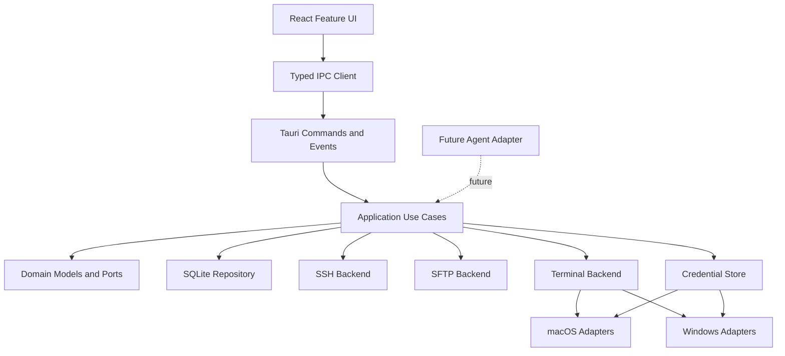

# Nocterm 客户端技术方案

- 状态：Draft 1.0
- 项目目录：`nocterm/nocterm`
- 目标平台：macOS、Windows
- 适用范围：首个稳定版本

## 1. 背景与目标

Nocterm 是一个本地优先的跨平台桌面终端产品，为 macOS 和 Windows 提供本地终端、远程连接、文件管理与本地配置能力。

首个稳定版本提供：

- 本地终端与多标签页；
- SSH 连接、会话管理和断线反馈；
- SFTP 文件浏览、文件操作、上传、下载与取消；
- 连接、分组和设置的 SQLite 本地持久化；
- macOS Keychain 与 Windows Credential Manager 凭据存储；
- macOS 和 Windows 一致的业务接口与验收标准。

Agent 不属于第一阶段核心。终端能力稳定后，只通过独立适配器接入成熟 Agent，不把任何厂商协议写入终端领域。

## 2. 非目标

第一阶段明确不做：

- 账户体系、远程配置服务和云端同步；
- 自研 Agent 或多 Agent 平台；
- Linux 正式适配、插件市场和自动更新；
- 为不确定需求提前建设微服务、事件总线或复杂插件系统；
- 为追求“分层”而给每个类型建立接口。

## 3. 架构原则

1. **模块化单体**：一个桌面产品、清晰模块边界，不拆分无部署价值的服务。
2. **依赖单向**：UI → IPC → Application → Domain；Infrastructure 通过 Port 接入。
3. **本地优先**：核心能力离线可用，配置和业务数据以本地 SQLite 为唯一数据源。
4. **密钥隔离**：数据库只保存凭据引用，密钥本体只进入系统安全存储。
5. **跨平台前置**：从第一天建立 macOS/Windows CI 和平台契约，不在业务代码中散落平台判断。
6. **纵向交付**：按可运行功能贯通 UI、IPC 和 Rust，不按技术层分批堆积代码。
7. **契约优先**：功能实现前先定义输入、输出、错误和生命周期，并建立相应测试。

## 4. 技术栈

| 层级     | 技术                                                       | 选择理由                                            |
| -------- | ---------------------------------------------------------- | --------------------------------------------------- |
| 桌面容器 | Tauri 2                                                    | 复用 Rust 本地能力，安装体积和系统集成成本可控      |
| UI       | React + TypeScript + Vite                                  | 生态成熟，类型约束和构建链路清晰                    |
| 终端渲染 | xterm.js                                                   | 成熟的终端渲染与插件生态                            |
| UI 状态  | React 本地状态；必要时再引入 Zustand                       | 阶段 0 不预装未使用的状态库，避免过早建立全局状态   |
| Rust     | Stable Rust workspace                                      | 用 crate 边界约束依赖方向                           |
| 本地数据 | SQLite + rusqlite                                          | 本地事务、查询和迁移机制明确                        |
| 本地终端 | portable-pty                                               | 统一 PTY 抽象，并验证 macOS PTY/Windows ConPTY 行为 |
| 凭据     | 平台 CredentialStore Adapter                               | macOS Keychain、Windows Credential Manager 分别实现 |
| 质量工具 | ESLint、Prettier、Stylelint、Vitest、Cargo fmt/clippy/test | 保持前后端一致的质量门禁                            |
| 提交治理 | EditorConfig、Husky、lint-staged、Commitlint               | 统一编辑器基线、暂存检查和提交信息                  |

具体依赖版本由脚手架阶段锁定，不在技术方案中提前绑定未经验证的版本。

## 5. 总体架构



### 5.1 分层职责

#### UI

- 页面布局、用户交互和展示状态；
- 不直接调用 `@tauri-apps/api`；
- 不接触数据库、系统路径、凭据或子进程；
- 跨 Feature 调用只能经过公开入口。

#### Typed IPC Client

- 封装 Tauri command/event；
- 统一参数、返回值、取消和订阅释放；
- 把 IPC 错误转换为前端可消费的错误对象。

#### Tauri Host

- 负责窗口生命周期、依赖装配和 IPC 注册；
- Command 只做参数校验、权限检查、用例调用和 DTO 转换；
- 不承载 SSH、SQL 或文件传输业务逻辑。

#### Application

- 编排连接、终端、传输等用例；
- 管理跨模块事务和运行时生命周期；
- 仅依赖 Domain Port，不依赖具体平台命令。

#### Domain

- 保存稳定的领域模型、状态机、错误码和 Port；
- 不依赖 Tauri、SQLite、React 和操作系统 API；
- 不包含 UI 文案和平台 stderr 解析。

#### Infrastructure/Platform

- 实现 SQLite、SSH/SFTP、PTY 和系统凭据适配器；
- 平台差异集中在 `platform/macos` 和 `platform/windows`；
- 原始系统错误在适配器边界归一化。

## 6. 建议目录结构

```text
nocterm/
├── apps/
│   └── desktop/
│       ├── src/
│       │   ├── app/                    # 路由、应用壳、Provider、启动流程
│       │   ├── features/
│       │   │   ├── connections/        # 连接和分组 UI
│       │   │   ├── terminal/           # 本地/远程终端 UI
│       │   │   ├── sftp/               # 文件管理 UI
│       │   │   ├── monitor/            # 服务器监控 UI
│       │   │   ├── settings/           # 本地设置 UI
│       │   │   └── agent/              # 后续 Agent UI，第一阶段不实现
│       │   ├── shared/
│       │   │   ├── components/         # 无业务含义的通用组件
│       │   │   ├── hooks/
│       │   │   ├── styles/
│       │   │   ├── lib/
│       │   │   └── types/
│       │   └── main.tsx
│       └── src-tauri/
│           ├── src/
│           │   ├── commands/           # 薄 IPC 适配层
│           │   ├── events/             # 后端事件映射
│           │   ├── state/              # AppState 与依赖装配
│           │   ├── dto/                # IPC DTO
│           │   ├── lib.rs
│           │   └── main.rs
│           └── tauri.conf.json
├── crates/
│   ├── nocterm-domain/
│   │   └── src/
│   │       ├── connection/
│   │       ├── terminal/
│   │       ├── sftp/
│   │       ├── credential/
│   │       ├── monitor/
│   │       └── error.rs
│   ├── nocterm-application/
│   │   └── src/
│   │       ├── connection/
│   │       ├── terminal/
│   │       ├── sftp/
│   │       ├── monitor/
│   │       └── runtime/
│   └── nocterm-infrastructure/
│       └── src/
│           ├── persistence/
│           ├── ssh/
│           ├── sftp/
│           ├── terminal/
│           ├── credential/
│           └── platform/
│               ├── macos/
│               └── windows/
├── docs/
│   ├── technical-architecture.md
│   ├── adr/                              # 有取舍的架构决策记录
│   ├── roadmap/                          # 能力矩阵与实施范围
│   └── testing/                          # 跨平台手工测试流程
├── scripts/                              # 构建、检查、打包脚本
├── Cargo.toml                            # Rust workspace
├── pnpm-workspace.yaml
├── package.json
└── README.md
```

目录不是为了拆得越细越好。只有形成独立职责和稳定边界的代码才进入单独模块；单文件优先控制在可理解范围内，超过约 300～400 行时检查是否混入多种职责，而不是机械拆分。

## 7. 模块与依赖规则

### 7.1 前端 Feature 规则

每个 Feature 可包含：

```text
feature-name/
├── api/          # 本 Feature 的 IPC Client
├── components/   # 展示组件
├── hooks/        # 交互编排
├── model/        # store、纯状态模型
├── pages/        # 路由级页面
├── types/        # Feature 内部类型
├── tests/
└── index.ts      # 唯一公开入口
```

- Feature 之间禁止引用对方内部文件；
- `shared` 不得依赖任何 Feature；
- Zustand Store 不承担数据库访问和进程控制；
- React Component 不直接组合 Tauri command 参数。

### 7.2 Rust crate 规则

```text
nocterm-domain          不依赖 application/infrastructure/tauri
nocterm-application     依赖 domain
nocterm-infrastructure  依赖 domain，实现 Port
desktop src-tauri       依赖 application + infrastructure，完成装配
```

禁止形成循环依赖。跨模块共享类型优先放在真正拥有该概念的 Domain 中，不建立无边界的 `common` 或 `utils` 大杂烩。

## 8. 核心领域边界

### 8.1 Connection

负责连接配置、分组、排序和认证方式引用。连接配置不包含密码或私钥明文。

### 8.2 Credential

定义 `CredentialStore`：保存、读取、删除和可用性检查。建议引用格式与平台实现解耦，例如 `credential://ssh/{connection_id}/password`。

### 8.3 Terminal

定义 `TerminalBackend` 和终端状态机：

```text
creating → running → closing → closed
                  ↘ failed
```

统一支持 open、write、resize、close、output、exit。进程句柄和平台 PTY 类型不得越过 Adapter 边界。

### 8.4 SSH

负责认证参数、主机密钥策略、连接超时、保活和会话状态。第一版优先封装系统 OpenSSH，由 Domain `SshTerminalPort` 和 Infrastructure `SshTerminalManager` 隐藏具体进程与 PTY 实现；平台探针负责报告 macOS `/usr/bin/ssh` 或 Windows `ssh.exe` 的可用性。

### 8.5 SFTP

对上层暴露结构化文件能力，不暴露 Shell 命令：list、stat、mkdir、rename、delete、upload、download、cancel。系统 OpenSSH 方案和原生 Rust SSH/SFTP 库需要通过 ADR 与跨平台原型确定；远程 Shell 脚本不能充当 SFTP 领域接口。

### 8.6 Runtime Task

终端会话和文件传输都使用唯一任务 ID，并具有显式状态、取消令牌和清理责任。窗口关闭、应用退出和连接删除时，必须有确定的资源回收策略。

## 9. 跨平台设计

Windows 不是最后补上的兼容层，而是从工程基线开始参与编译和契约验证。

| 能力     | macOS                         | Windows                          | 统一边界                 |
| -------- | ----------------------------- | -------------------------------- | ------------------------ |
| 本地终端 | PTY                           | ConPTY                           | `TerminalBackend`        |
| 凭据     | Keychain                      | Credential Manager               | `CredentialStore`        |
| SSH      | `/usr/bin/ssh` 或后续原生实现 | `ssh.exe` 能力探测或后续原生实现 | `SshTerminalPort`        |
| SFTP     | 待 ADR 验证                   | 待 ADR 验证                      | `SftpBackend`            |
| 路径     | POSIX path                    | Windows path                     | `LocalPath`/平台 Adapter |
| 进程信号 | Unix signal                   | Windows process control          | `ProcessController`      |
| 打包     | `.app`/`.dmg`                 | `.msi`/`.exe`                    | 构建流水线               |

平台规则：

- 业务模块中不得通过字符串判断操作系统；
- `cfg(target_os)` 只允许出现在 platform/adapter 和依赖装配处；
- 公共 DTO 不出现 `PathBuf`、HANDLE、PID 信号等平台专用语义；
- 每个纵向功能必须同时定义 macOS 与 Windows 验收项；
- CI 从骨架阶段同时执行 macOS 和 Windows 编译、单测和静态检查。

## 10. 数据与安全

### 10.1 SQLite

- Schema 必须有真实迁移文件，禁止通过删除用户数据库升级；
- Repository 负责 SQL，Domain/Application 不拼 SQL；
- WAL、foreign keys、busy timeout 在数据库初始化处统一设置；
- 运行时会话和传输进度默认不持久化；
- 首个稳定版本的 Schema 只包含当前业务需要的字段。

### 10.2 凭据

- 密码、私钥明文和未来 API Key 禁止进入 SQLite、日志和 IPC 事件；
- 前端只能提交一次性凭据写入请求，读取接口原则上不返回明文；
- 临时 askpass/私钥文件必须使用独立目录、最小权限并保证清理；
- 日志统一执行 host、username、path 和 secret 脱敏策略。

### 10.3 主机密钥

不得用“无条件忽略主机密钥”换取易用性。首次连接、密钥变化和用户确认必须形成明确状态，并由 SSH Adapter 统一实现。

## 11. IPC 与错误规范

Command 命名按领域组织，例如：

```text
connection_list
connection_upsert
terminal_open
terminal_write
terminal_resize
terminal_close
sftp_transfer_cancel
```

统一错误结构：

```ts
interface AppError {
  code: string;
  message: string;
  retryable: boolean;
  details?: Record<string, unknown>;
}
```

- `code` 是稳定契约，UI 不解析 stderr 文本；
- `message` 是安全、可展示的默认文案；
- 原始错误仅进入脱敏后的本地诊断日志；
- 高频输出和进度使用 event，状态变更命令使用 command；
- 所有 event 订阅必须返回释放函数并在组件/会话销毁时执行。

脚手架阶段通过 ADR 决定 Rust DTO 到 TypeScript 的自动类型生成方案；在方案确定前，至少通过 IPC 契约测试防止两侧类型漂移。

## 12. 测试与质量门禁

### 12.1 测试分层

- Domain：状态机、校验和错误映射单元测试；
- Application：使用 Fake Port 验证用例、取消和资源回收；
- Infrastructure：SQLite、PTY、凭据、SSH/SFTP 集成测试；
- IPC：Command/DTO 契约测试；
- UI：纯模型、Hook 和关键交互测试；
- E2E：macOS、Windows 启动及核心链路冒烟测试；
- 手工验收：真实本地 Shell、SSH 主机和大文件传输。

### 12.2 合并门禁

```text
pnpm lint
pnpm format:check
pnpm test
pnpm build
cargo fmt --check
cargo clippy --workspace --all-targets -- -D warnings
cargo test --workspace
commitlint（本地 commit-msg 与 CI）
tauri build（发布分支或发布流水线）
```

脚手架阶段建立 macOS/Windows CI Matrix。任何平台未通过时，不得把对应功能标记为跨平台完成。

## 13. 实施路线

功能建设遵循纵向交付：

```text
定义行为契约与验收用例
→ 贯通 UI、IPC、Application 和 Infrastructure
→ 完成自动测试
→ macOS/Windows 分别验证
→ 更新能力矩阵与必要 ADR
→ 才进入下一功能
```

本项目采用迭代式建设：以稳定的行为契约、清晰的模块边界、跨平台适配和可验证的测试为约束，持续完善产品能力。任何用户可见行为变更都必须经过明确的产品决策和验收。

每个实施单元必须形成一项可独立验证、可独立提交的功能目标。测试、Migration、IPC DTO 和必要文档应随所属功能一起完成；不得提前实现下一功能的占位代码、未来接口或无消费者的抽象。

### 阶段 0：工程骨架（已完成）

- 创建 pnpm/Rust workspace、Tauri 和 React 最小应用；
- 建立三层 Rust crate 和前端 Feature 边界；
- 建立统一错误、日志、配置和 IPC 示例链路；
- 建立 macOS/Windows CI；
- 完成“启动应用 → UI 调用 health command → 返回结构化结果”。

阶段 0 只负责建立可持续开发的工程基线，不继续添加脱离真实业务的技术示例。后续 ADR 在对应业务首次需要该决策时完成。

### 阶段 1：SSH 完整链路建设

目标是建立一致的连接页和终端页体验，并跑通“保存连接 → 打开 SSH 终端 → 输入输出 → 调整尺寸 → 关闭会话”。按以下子功能依次建设：

1. **应用壳与终端页面**：建设 `ActivityBar`、`Sidebar`、`TerminalTabs`、`StatusBar`、主题 Token 和窗口布局。
2. **连接资料与列表**：定义连接资料、连接列表、新建弹窗、搜索、分组和排序行为；按架构拆分 UI、用例和 SQLite Repository。
3. **系统凭据**：实现密码、私钥和 SSH Agent，通过 `CredentialStore` 分别适配 macOS Keychain 与 Windows Credential Manager；数据库只保存引用。
4. **终端会话**：实现 xterm.js、多标签页、会话状态、输出订阅和资源释放；后端统一 `open/write/resize/close/output/exit` 契约。
5. **SSH 后端**：实现系统 OpenSSH 调用、认证参数、初始目录、保活和断线处理，并补齐主机密钥与 Windows 能力探测。
6. **验收**：覆盖页面、交互和真实 SSH 行为，macOS/Windows 分别记录结果。

### 阶段 2：SFTP 完整链路建设

目标是建立双栏文件管理页面和稳定的文件操作体验，复用阶段 1 的连接与凭据能力。按以下子功能依次建设：

1. **SFTP 页面**：建设导航入口、连接侧栏、双栏布局、路径栏、文件列表、选择态和反馈样式；
2. **目录浏览**：实现本地与远程目录读取、父级导航、刷新和错误展示；
3. **文件操作**：实现创建目录、重命名、删除和覆盖确认；
4. **文件传输**：实现上传、下载、进度、取消、目录传输和失败清理；
5. **验收**：覆盖大文件、Unicode 路径、权限错误、覆盖和网络中断。

正式实现前通过 ADR-002 的 macOS/Windows 原型确定 SFTP Adapter；允许替换不符合跨平台契约的底层实现，但不得改变已确认的上层页面和交互契约。

### 阶段 3：其余本地客户端能力

在 SSH 与 SFTP 稳定后，按产品路线依次建设：

1. 本地终端；
2. 设置与主题；
3. 服务器监控；
4. 连接备份、恢复和 OpenSSH Config 导入。

### 阶段 4：成熟 Agent

- 定义最小 `AgentAdapter`；
- 只接入一个成熟 Agent；
- 命令必须绑定明确终端、经过确认并返回真实结构化结果。

Agent 只能在基础终端能力稳定后开始，不提前创建占位接口或预留实现。

### 功能提交边界

- 一次提交只表达一个完整功能意图，不按 UI、Rust 或数据库技术层拆分半成品提交；
- 一个功能需要的 UI、IPC、Application、Domain、Infrastructure、测试、Migration 和必要文档应在同一交付单元内闭环；
- 不得混入下一功能代码、顺手重构或与当前验收无关的依赖升级；
- 提交前必须完成对应检查，区分静态通过、自动测试通过和目标平台真实验收；
- 是否执行 `git commit` 仍须由用户明确确认。

提交信息示例：

```text
feat(shell): build desktop workspace layout
feat(ssh): implement connection profiles
feat(ssh): implement terminal session lifecycle
feat(sftp): build remote directory browsing
```

## 14. 脚手架阶段完成标准

基础框架只有同时满足以下条件才算完成：

- 工程不依赖未纳入技术方案的外部运行时服务；
- macOS 和 Windows CI 均能编译；
- UI、IPC、Application、Domain、Infrastructure 依赖方向可检查；
- 示例 Command 和 Event 端到端可运行；
- 平台 Adapter 能通过能力探测返回结构化结果；
- lint、format、unit test、build 命令统一且通过；
- README、开发规范、ADR 模板和测试说明齐全；
- 尚未引入任何未经行为测试保护的业务代码。

## 15. 架构决策清单

脚手架实施前后需要形成以下 ADR：

1. `ADR-001`：模块化单体与 Rust workspace 边界；
2. `ADR-002`：系统 OpenSSH 与原生 Rust SSH/SFTP 的阶段性选择；
3. `ADR-003`：macOS/Windows 凭据 Adapter 实现；
4. `ADR-004`：Rust IPC DTO 到 TypeScript 的类型同步方式；
5. `ADR-005`：SQLite Schema 与版本迁移策略；
6. `ADR-006`：终端输出、进度事件和背压策略。

## 16. 风险与控制

| 风险                   | 控制措施                                   |
| ---------------------- | ------------------------------------------ |
| 跨模块行为不一致       | 先定义行为契约和回归用例，再贯通完整调用链 |
| Windows 最后才暴露问题 | 从阶段 0 建立 Windows CI，每阶段双平台验收 |
| 过度分层拖慢开发       | 固定三个 Rust crate，只在稳定边界建立 Port |
| IPC 类型漂移           | 类型生成或契约测试作为脚手架门禁           |
| 凭据或日志泄漏         | 安全存储、最小明文生命周期、统一脱敏       |
| SSH/SFTP 技术路线选错  | 通过 ADR 原型验证认证、跳板机和大文件传输  |

## 17. 文档维护

- 架构边界、平台契约或关键依赖发生变化时，更新本方案和对应 ADR；
- 功能与平台验收状态记录在 `docs/roadmap/capability-matrix.md`；
- 真实运行流程和验收步骤记录在 `docs/testing/`；
- 静态检查、编译或进程启动不得标记为功能已验收。
